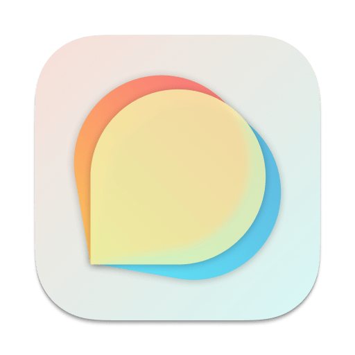

## Forumate

A native client to access Discourse server for Apple Platforms.

### Platform Compatibility

- [x] iOS 17+
- [x] iPadOS 17+
- [x] watchOS 10+
- [x] tvOS 17+
- [x] macOS(Catalyst) 14+
- [ ] macOS 14+
- [x] visionOS 1+

> tvOS target is buildable, but due to [#17](https://github.com/Kyle-Ye/Forumate/issues/17). I can't upload a tvOS binary to App Store.
>
> macOS is buildable, but is not optimized for. It's better to build under Catalyst.
>
> visionOS is buidable, but is not optimized for. Hope I can get a real device to test for it.

### Version Compatibility

- v0.1~v0.3 supports iOS 16+, watchOS 9+ and macOS 13+ (Xcode 14.3.1)
- v0.4.0-beta only supports iOS & iPadOS 17 Beta 1, watchOS 10 Beta 1 and macOS 14 Beta 1 (Xcode 15 beta 1)
- v0.4.1-beta only supports iOS & iPadOS 17 Beta 2-3, watchOS 10 Beta 2-3 and macOS 14 Beta 2-3 (Xcode 15 beta 2)
- v0.5.0-beta only supports iOS & iPadOS 17 Beta 4, watchOS 10 Beta 4 and macOS 14 Beta 4 (Xcode 15 beta 5)
- v0.5.1-beta only supports iOS & iPadOS 17 Beta 5, watchOS 10 Beta 5 and macOS 14 Beta 5 (Xcode 15 beta 6)
- v0.5.2-beta only supports iOS & iPadOS 17 Beta 6-7, watchOS 10 Beta 6-7 and macOS 14 Beta 6 (Xcode 15 beta 7)

## Download

### Mac App Store Release

Waiting to be released

### Join Beta on TestFlight

[Join beta on TestFlight](https://testflight.apple.com/join/4kpEtmsk)

### Github Release

For macOS users, you can download the Notarized macOS Catalyst binary on https://github.com/Kyle-Ye/Forumate/releases/

> Mac App Store℠ and TestFlight® are trademarks of Apple Inc., registered in the U.S. and other countries.

## Screenshots

## License

The copyright of the binary files uploaded to the App Store belongs to Kyle-Ye.

You are permitted to use this source code, with or without modification, in source or binary form, on your devices however you see fit. You are not permitted to redistribute binaries of this source code, with or without modification. In other words, you cannot put this application or any application derived from it, on the Apple App Store, Cydia, or any other binary-only distribution channel.

上传到 App Store 的二进制文件的版权归 Kyle-Ye 所有。

你可以任意修改、使用该源代码，也可以用于商业目的。但不能将此应用或者修改的应用的二进制文件上传到 App Store 或者通过其它分发渠道（包括但不限于网站、网盘、聊天软件）分享二进制文件。
