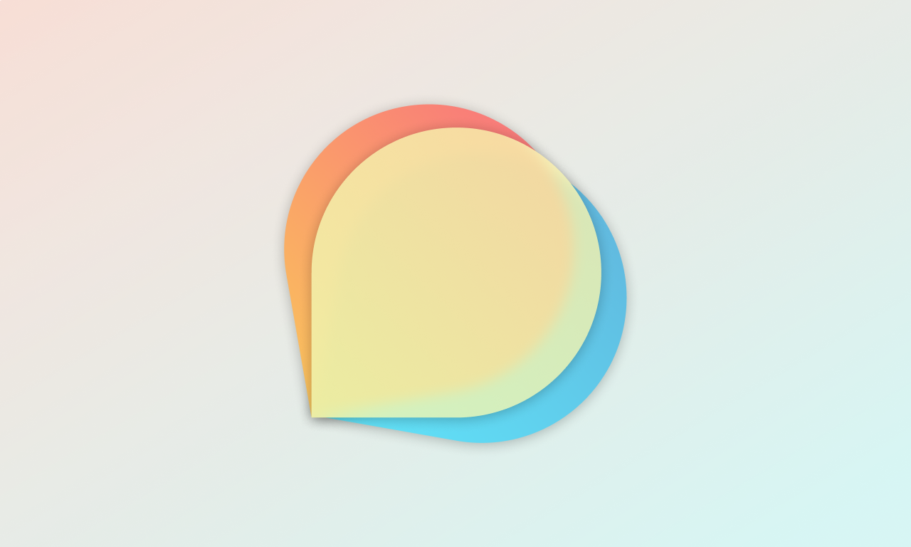

## Forumate

A native client to access Discourse server for Apple Platforms.

### Platform Compatibility

-   [x] iOS 17+
-   [x] iPadOS 17+
-   [x] watchOS 10+
-   [x] tvOS 17+
-   [x] macOS 14+
-   [x] visionOS 1+

### Version Compatibility

| Forumate | Xcode  | iOS & iPadOS | watchOS | tvOS  | macOS |
| :------: | :----: | :----------: | :-----: | :---: | :---: |
|  0.8.0   | 15.0.1 |    17.0+     |  10.0+  | 17.0+ | 14.0+ |

|  Forumate  |   Xcode   |  iOS & iPadOS  |   watchOS   | macOS(Catalyst) | visionOS |
| :--------: | :-------: | :------------: | :---------: | :-------------: | :------: |
|   0.7.0    |  15.0.1   |     17.0+      |    10.0+    |      14.0+      |    ❌    |
| 0.6.0-beta | 15 Beta 8 |   17 Beta 8    |  10 Beta 8  |    14 Beta 7    | 1 Beta 3 |
| 0.5.2-beta | 15 Beta 7 | 17 Beta 6 ～ 7 | 10 Beta 6~7 |    14 Beta 6    |    ❌    |
| 0.5.1-beta | 15 Beta 6 |   17 Beta 5    |  10 Beta 5  |    14 Beta 5    |    ❌    |
| 0.5.0-beta | 15 Beta 5 |   17 Beta 4    |  10 Beta 4  |    14 Beta 4    |    ❌    |
| 0.4.1-beta | 15 Beta 2 | 17 Beta 2 ～ 3 | 10 Beta 2~3 |   14 Beta 2~3   |    ❌    |
| 0.4.0-beta | 15 Beta 1 |   17 Beta 1    |  10 Beta 1  |    14 Beta 1    |    ❌    |

| Forumate | Xcode  | iOS & iPadOS | watchOS | macOS(Catalyst) |
| :------: | :----: | :----------: | :-----: | :-------------: |
| 0.1~0.3  | 14.3.1 |     16+      |   9+    |       13+       |

## Download

### Mac App Store Release

Waiting to be released

### Join Beta on TestFlight

[Join beta on TestFlight](https://testflight.apple.com/join/4kpEtmsk)

### Other Channel

For macOS users, you can download the Notarized App on [GitHub Releases](https://github.com/Kyle-Ye/Forumate/releases)

> Mac App Store℠ and TestFlight® are trademarks of Apple Inc., registered in the U.S. and other countries.

## Screenshots

## The Project Inspiration

In 2021, considering the unsatisfactory experience of Swift Forums on iPhone, I posted a [topic](https://forums.swift.org/t/swift-forum-client/53484) asking for a Swift Forum's client recommendation.

Someone recommended Fig to me. I like Fig and browsed Swift Forum via Fig all the time since then.

Unfortunately, Fig's author [announced](https://meta.discourse.org/t/fig-native-discourse-client-for-ios/148352/102) that he will not actively continue the development, and wished to sell the ownership of Fig.

No suitable offers surfaced and I decided that instead of waiting for others to do something about this, I should act myself.

So after Fig had not been updated for about 2 years and even been removed from the App Store, I start to build Forumate from scratch in my spare time with SwiftUI.

## License

Kyle-Ye Apple Platform Project License

See License.txt for details.
